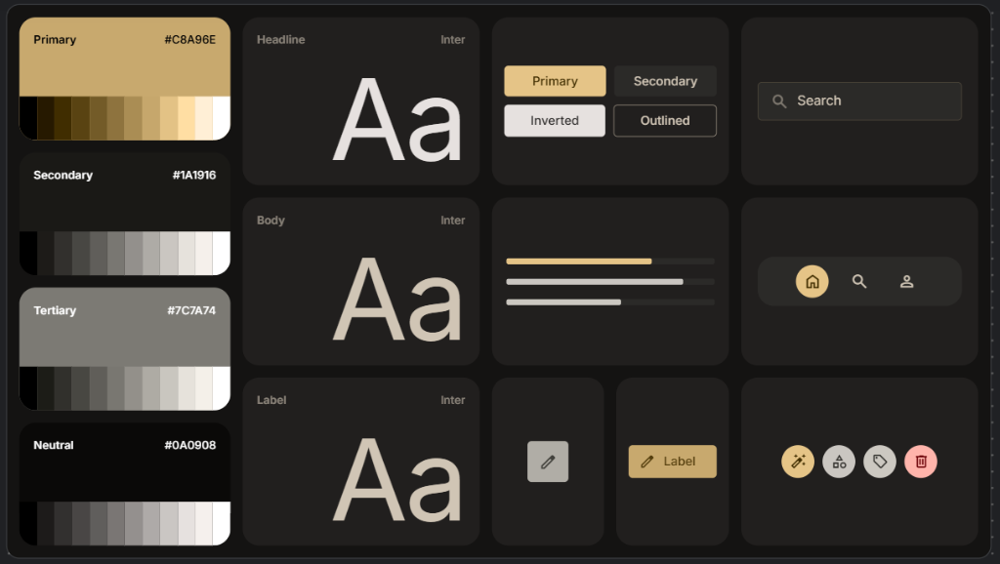

# Emmanuel — Architecte de l'Invisible

Un portfolio haut de gamme et immersif conçu pour les recruteurs et les amateurs de design d'exception. Ce projet allie rigueur mathématique et sensibilité artistique à travers une direction artistique soignée nommée **Obsidian Forge**.

---

## 🎨 Design System & Direction Artistique

Le projet est basé sur un design system rigoureux alliant le luxe, l'or et la profondeur de l'obsidienne.



### Fondations Visuelles
*   **Thème Principal** : Obsidian Forge (Noirs profonds, gris texturés, lueurs d'accentuation Lux Gold `#C8A96E`).
*   **Typographie** : Alliance d'une Serif italique élégante pour les titres et d'une Mono technique pour les détails structurels.
*   **Aura WebGL** : Un fond dynamique de particules et de gradients en mouvement constant, attiré physiquement par le pointeur de l'utilisateur.

---

## 🛠️ Stack Technique

Le site est propulsé par les technologies les plus modernes et performantes de l'écosystème web :

*   **Framework** : [Next.js 15 (App Router)](https://nextjs.org/) & [React 19](https://react.dev/)
*   **Style** : [Tailwind CSS v4 (CSS-First)](https://tailwindcss.com/)
*   **Animations & Physique** : [GSAP (GreenSock)](https://gsap.com/) & [Framer Motion](https://www.framer.com/motion/)
*   **Effets 3D** : [Three.js / WebGL](https://threejs.org/)
*   **Défilement Fluide** : [Lenis Smooth Scroll](https://lenis.darkroom.engineering/)

---

## ⚡ Fonctionnalités Clés

1.  **WebGL Fluid Aura** : Arrière-plan génératif qui interagit avec le curseur utilisateur.
2.  **Custom Inertial Cursor** : Un curseur personnalisé doté d'une physique de lag (lerp) pour un suivi ultra-fluide.
3.  **Adaptive Motion** : Respect réactif et complet des préférences système d'accessibilité (`prefers-reduced-motion`) désactivant instantanément les animations lourdes et translations.
4.  **Works Vector Schematics** : Des visuels géométriques vectoriels uniques pour chaque projet dans la galerie.
5.  **Interactive Counter** : Des compteurs statistiques animés de façon fluide via RequestAnimationFrame.

---

## 🚀 Démarrage Rapide

### Prérequis
*   Node.js (v20 ou supérieur recommandé)
*   pnpm (gestionnaire de paquets)

### Installation
1.  Installez les dépendances :
    ```bash
    pnpm install
    ```
2.  Lancez le serveur de développement :
    ```bash
    pnpm run dev
    ```
3.  Ouvrez [http://localhost:3000](http://localhost:3000) pour voir le résultat.

---

Créé avec rigueur et passion par **iamydgel**.
